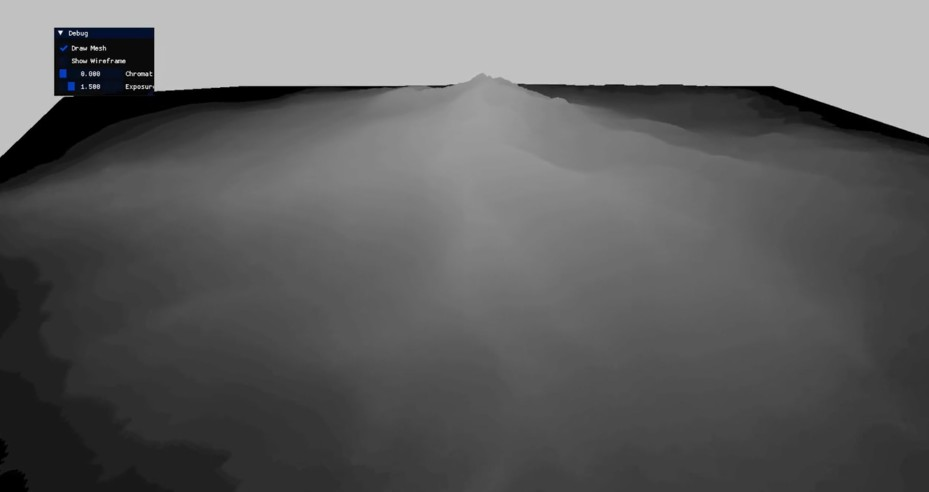
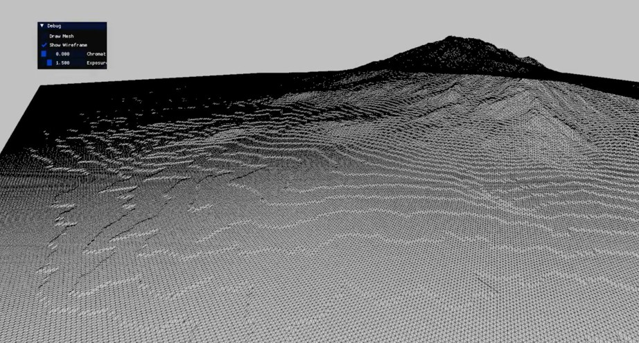
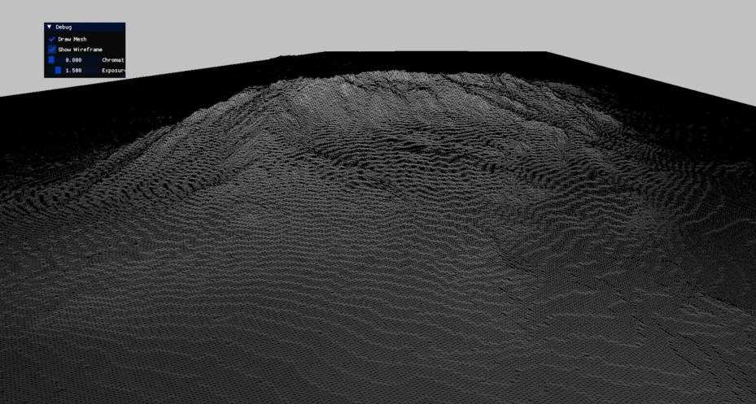

# Terrain
A terrain rendering demo built with **LVK** that generates a 3D terrain mesh from a heightmap, includes basic post process pass as well.  

**Work In Progress**

****

## Features
- Heightmap-based terrain generation
- Bilinear interpolation for smooth height sampling
- Adjustable terrain resolution independent of source image resolution
- Wireframe visualization
- First-person camera controls
- ImGui debug interface
- Post-processing pass
  - Chromatic Aberration
  - Exposure control

## Screenshots

  
  

  

## Rendering

Rendering consists of two passes.

#### Scene Pass

The terrain is rendered into an off-screen framebuffer.

Optional rendering modes include:

- Solid rendering
- Wireframe overlay

#### Post Processing Pass

The off-screen image is rendered to the swapchain while applying post-processing effects.

Current effects include:

- Chromatic Aberration
- Exposure adjustment

---

## Controls

| Action | Input |
|---------|-------|
| Move Camera | WASD |
| Look Around | Mouse |
| Toggle Wireframe | ImGui |
| Draw Filled Mesh | ImGui |
| Exposure | ImGui Slider |
| Chromatic Aberration | ImGui Slider |

## Technologies

- C++
- Vulkan
- GLFW
- GLM
- ImGui
- stb_image (heightmap loading)
- LVK Rendering Framework